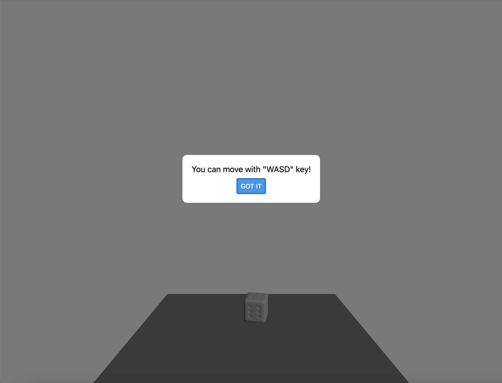

# DiceRoller 🎲 – Physics Engine 3D Dice Rolling Simulation


## 🌐 Demo  
🔗 **Live Website:** [Try DiceRoller](https://diceroller-jet.vercel.app/)

## 📜 Description  
**DiceRoller** is a cross-platform web and mobile app that simulates realistic 3D dice rolls.  
Users can interact with virtual dice using different device controls:
- 📱 Shake the phone on mobile to roll
- 💻 Use WASD keys on the web to trigger the roll

I built DiceRoller using **React Native (with Expo)** and **TypeScript**, integrating **expo-three** for 3D rendering and **Cannon.js** for realistic physics simulation.  

### 🚀 **Planned Features**
- Improve physics engine
- Add custom dice types (e.g., D20, D12, D4) 
- Visual themes and dice skin customization
- Sound effects and haptic feedback support

## 📸 Screenshots  



## 🛠️ Tech Stack  
- **Cross-Platform Framework:** React Native (via Expo), TypeScript 
- **3D Graphics:** expo-three, Three.js 
- **Physics Engine:** Cannon.js 
- **Platform Support:** React Native Web, Expo, Shake Detection (react-native-shake)  

## 📦 Installation

### Prerequisites
- Node.js (v18 or later)
- Expo CLI (if not installed: `npm install -g expo-cli`)
- Git

### 🔧 Setup
```bash
# Clone the repository
git clone https://github.com/BCITKevin/DiceRoller.git

# Navigate into the project folder
cd DiceRoller

# Install dependencies
npm install

# Start the app with Expo
npm start
```
